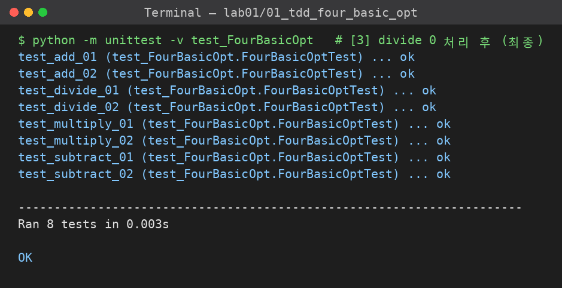
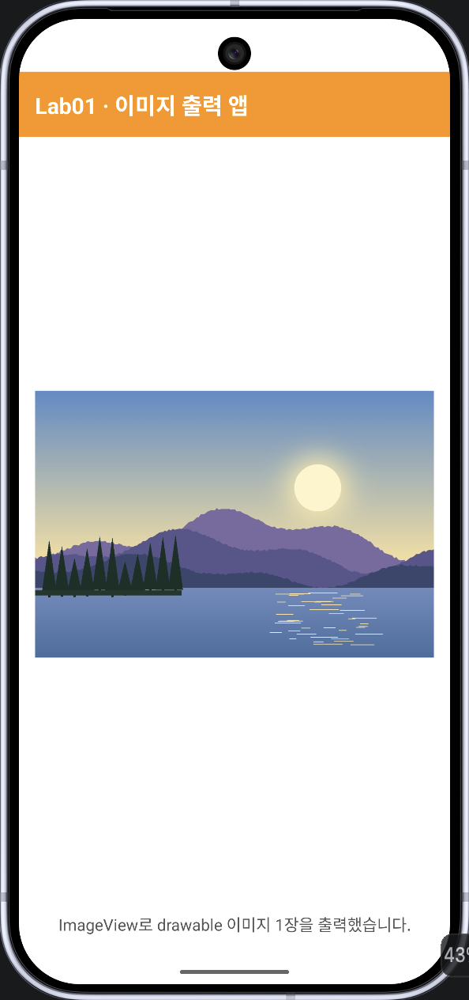

# lab01

| 폴더 | 실습 |
|---|---|
| [`01_tdd_four_basic_opt/`](01_tdd_four_basic_opt) | 실습 1 - Test-Driven Development: 사칙연산 (ch04 p.48~52) |
| [`02_android_image_app/`](02_android_image_app) | 실습 2 - 이미지 1장을 화면에 출력하는 안드로이드 앱 |

## 실습 1 결과 (최종 콘솔)

## 실습 2 결과 (에뮬레이터 화면)

